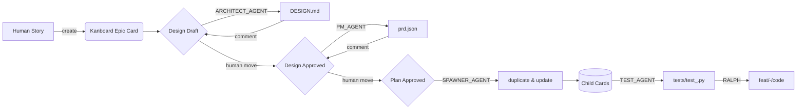

# AgentLeeOps Governance Review  
*Preventing silent overwrites, runaway agents, and “oops, we lost the ratchet” moments.*

---

## 1. TL;DR
- **Approval gates** = Kanboard columns only → agents can advance cards if permissions allow.  
- **Ratchet** = handshake promise only → approved files can still be overwritten.  
- **Fan-out** = duplicate-then-update is **not** atomic → orphans & duplicates on failure/re-run.  
- **Observability** = print() and stuck “started” tags → no retries, no dead-letter.  
- **Tests** = zero coverage for Kanboard APIs or duplication hack.

---

## 2. Architecture at a Glance

**Approval Enforcement**  
❌ **None** – agents trust column name + tag only.

---

## 3. Governance / Ratchet Violations
| Risk | Impact | Where |
|------|--------|-------|
| Agent can move card to “Approved” column if KB permissions allow | Silent bypass of human gate | Kanboard RBAC |
| DESIGN.md / prd.json / tests overwritten on every agent run | Approved artifact lost | all agents |
| No checksum / version check before overwrite | Regression impossible to detect | workspace.py |
| Ralph commits `git add .` → could change tests after approval | Tests immutable rule broken | ralph.py |

---

## 4. Fan-out “Duplication Hack” Deep Dive
| Concern | Current State | Safe Minimum Fix |
|---------|-------------|------------------|
| **Idempotency** | re-run = duplicate children | Pre-check `atomic_id` metadata |
| **Atomicity** | dup ok + update fail → orphan | Try / except → delete orphan |
| **Uniqueness** | `atomic_id` can be None | Hard fail if missing |
| **Race** | multi orchestrator → dupes | Add `spawning_lock` tag (w/ expiry) |
| **Injection** | title/desc from LLM → KB | Markdown only → OK for now; add length limit |

---

## 5. Error & Observability Gaps
- **Stuck cards**: “started” tag never cleared on failure → blocks retries.  
- **Logs**: `print()` → no JSON, no correlation-id.  
- **Dead-letter**: no quarantine column or “failed” tag.  
- **Alerts**: none → silent failures possible.

---

## 6. Test Coverage
| Module | Unit | Integration | Comment |
|--------|------|-------------|---------|
| Kanboard client | ❌ | ❌ | Mocked nowhere |
| Duplicate hack | ❌ | ❌ | No happy-path test |
| Approval gates | ❌ | ❌ | No RBAC test |

---

## 7. Recommendations (Prioritized)

### P0 ‑ Blockers
1. **Explicit approval metadata**  
   File: `orchestrator.py` – `process_*_task()`  
   Add: read `approved_by` custom field; abort if empty.

2. **Ratchet file guard**  
   File: `workspace.py` – `write_file()`  
   Add: if file exists and `approved_*` metadata set → write to `<file>.v2` or abort.

3. **Idempotent spawner**  
   File: `agents/spawner.py` – `run_spawner_agent()`  
   Add: skip if child with same `atomic_id` already linked to parent.

4. **Transaction wrapper**  
   File: `agents/spawner.py`  
   Add: on update/link failure → `deleteTask(duplicate_id)` and raise.

### P1 ‑ High Value
5. **Structured logs**  
   File: all agents – replace `print()` with `logging.info(extra={"task_id": …})`.

6. **Test integrity check**  
   File: `agents/ralph.py` – before commit  
   Add: `git diff --quiet HEAD -- tests/ || exit 1`.

7. **Retry / dead-letter**  
   File: `orchestrator.py` – on exception  
   Add: remove “started” tag or add “failed” tag → enables re-run.

### P2 ‑ Nice to Have
8. **Unit tests for duplication**  
   File: `tests/test_spawner.py`  
   Mock Kanboard client; assert duplicate + update + metadata + link.

9. **Lock against concurrent orchestrators**  
   File: `lib/kanboard_lock.py`  
   Add: short-lived `spawning_lock` task metadata with TTL.

---

## 8. Questions for the Author
1. Who is allowed to set `approved_by` – any KB user or named humans?  
2. Should files be versioned or immutable after approval?  
3. Auto-retry spawner on failure or manual intervention only?  
4. Is `atomic_id` globally unique or only within an epic?  
5. Do you want audit logs outside KB (e.g., SIEM)?  
6. Max child tasks per epic to avoid accidental 1000-card flood?  
7. Are LLM outputs allowed to contain HTML/JS in Kanboard?  
8. Expected max concurrent orchestrator instances – 1 or N?

---

*Use this markdown as the living review record; turn each P0 into a PR and add the ratchet guard once in `workspace.py` – every agent inherits it automatically.*
